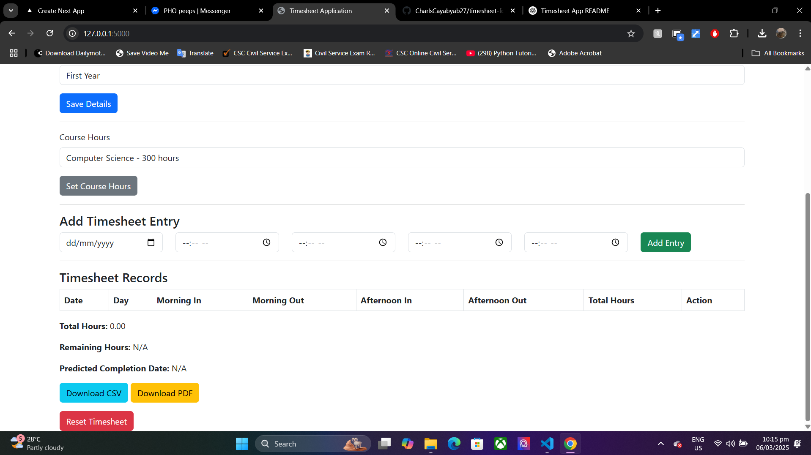

# Timesheet Application for OJT

## Overview
The **Timesheet Application for OJT** is a web-based system designed to track and manage on-the-job training (OJT) hours for students. It allows users to log their daily working hours, calculate total hours, and generate reports.

## Features
- **User Details Entry**
  - Full Name
  - Company Name
  - Company Address
  - College Year Selection
  
- **Timesheet Management**
  - Add Timesheet Entries (Date, Morning In/Out, Afternoon In/Out)
  - Auto Calculation of Total Hours
  - Display of Timesheet Records
  
- **Course Hours Tracking**
  - Set Course Hours (e.g., Computer Science - 300 hours)
  - Track Remaining Hours
  - Predict Completion Date
  
- **Export Options**
  - Download Timesheet as CSV
  - Download Timesheet as PDF
  
- **Admin Controls**
  - Reset Timesheet

## Technologies Used
- **Backend:** Flask (Python)
- **Frontend:** HTML, CSS, JavaScript
- **Database:** CSV (for storing records)

## Setup Instructions
1. Clone the repository:
   ```bash
   git clone https://github.com/CharlsCayabyab27/timesheet-for-OJT
   cd timesheets
   ```
2. Install dependencies:
   ```bash
   pip install -r requirements.txt
   ```
3. Run the Flask application:
   ```bash
   python app.py
   ```
4. Open a browser and navigate to:
   ```
   http://127.0.0.1:5000
   ```

## Screenshots


## License
This project is licensed under the MIT License.

## Contact
For any inquiries, please contact [Your Email or GitHub].
